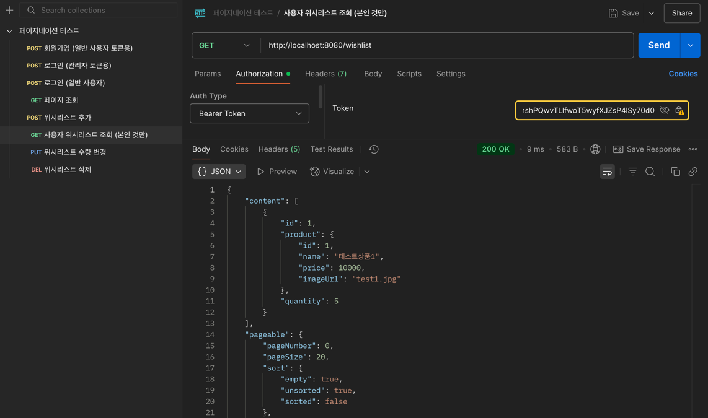
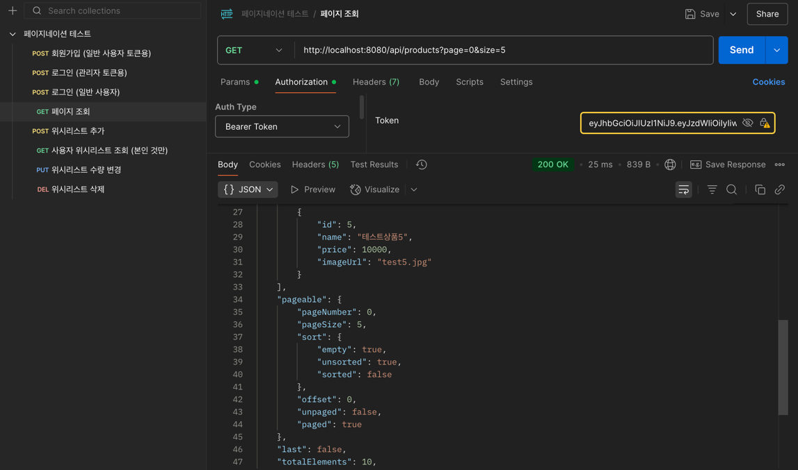

#Step2

## 과제 진행 요구 사항
상품과 위시 리스트 보기에 페이지네이션을 구현한다.

대부분의 게시판은 모든 게시글을 한 번에 표시하지 않고 여러 페이지로 나누어 표시한다. 정렬 방법을 설정하여 보고 싶은 정보의 우선 순위를 정할 수도 있다.
페이지네이션은 원하는 정렬 방법, 페이지 크기 및 페이지에 따라 정보를 전달하는 방법이다.

---
# 구현 내용

- Service 수정
  - [x] 기존 List 반환 메서드를 Page로 변경
  - [x] DTO 변환 시 Page.map() 사용
  
- Controller 수정
  - [x] 기존 List 반환 메서드를 Page로 변경
  - [x] Pageable 파라미터 추가

- 테스트 케이스
  - [x] 페이지 크기 적용 확인
  - [x] 페이지 번호 이동 확인 (중복 확인)
  - 시나리오 
    1. 어드민 로그인
    2. 어드민 권한으로 상품 추가 
    3. 일반 사용자 회원가입 
    4. 일반 사용자 토큰으로 로그인 
    5. 상품 페이지네이션 적용돼서 조회 가능 여부
    6. 그 페이지에서 일반 사용자가 특정 상품 본인의 위시리스트로 위시 추가 
    7. 본인의 토큰 이용해서 위시리스트 볼 수 있는지 여부
    8. 해당 위시리스트 페이지네이션 잘 되는지 여부
    9. 정렬 방법을 다양하게 설정하여 보고 싶은 정보의 우선 순위를 정할 수도 있는지 여부
    10. 상품 수량 추가/삭제 가능 여부

