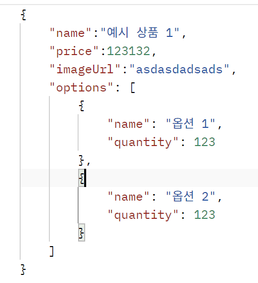
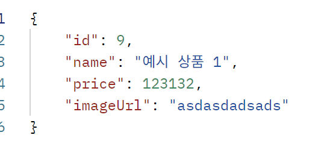
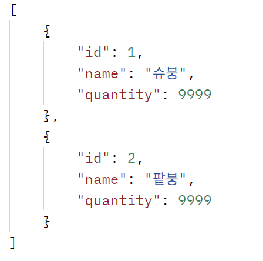
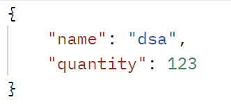
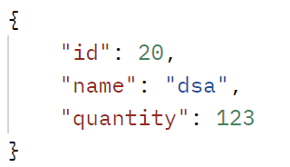
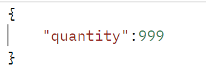
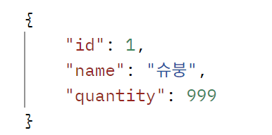

# spring-gift-enhancement

# step 1
- repository의 Jdbc Client 기반 코드를 Jpa로 리팩토링
  - 기존 도메인 객체를 엔티티로 변경
  - 기존 Jdbc Client 로 구현된 repository 구현체 삭제
  - repository 인터페이스를 JpaRepository를 상속하도록 변경
  - service 레이어의 코드 변경한 Jpa 코드와 호환되도록 변경
  - 테스트 코드 작성

# step 1 피드백 반영
- 주석 제거
- 주생성자 활용 (생성자 체이닝을 통한 코드 중복 최소화)
- 엔티티 요구사항 충족 (not null, unique)
- 도메인 클래스에서 dto 변환 로직 제거
- display name을 통해 어떤 테스트인지 표현
- 엔티티 클래스 파라미터 없는 생성자 접근 제한자 수정

# step 1 피드백 추가 반영
- 기본생성자, 부 생성자, 주 생성자 정의 위치 변경
- 업데이트 시 save 대신 더티 체킹을 통한 업데이트로 변경

# 기타 수정 사항
- on delete cascade 추가

# step 2
- 상품 목록에 페이지네이션 구현
  - 이름 순 오름차순으로 페이지 당 5개로 기본 설정
- 멤버 별 위시 목록에 페이지네이션 구현
  - 상품 아이디 순 오름차순으로 페이지 당 5개로 기본 설정

# step 2 피드백 반영
- 관리자 페이지 페이지네이션 적용
- 객체 지향 생활 체조 4원칙을 참조 (디미터의 법칙) 코드 리팩토링
- 변수 및 setter 네이밍 변경

# step 3
- 상품 정보에 옵션 추가
  - 상품 등록 시 최소 하나의 옵션이 포함되야 등록이 가능
    - request: 'POST /api/products'
    - 
    - response: '201 CREATED'
    - 
    - 옵션 이름은 공백을 포함해 최대 50자 까지 입력 가능
    - 옵션 수량은 최소 1개, 최대 1억개
  - 상품의 옵션 조회 기능 구현
    - request: 'GET /api/products/{productId}/options'
    - response: '200 OK'
    - 
  - 상품 등록 후 옵션 추가 기능 구현
    - request: 'POST /api/products/{productId}/options'
    - 
    - response: '201 CREATED'
    - 
    - 옵션 이름은 공백을 포함해 최대 50자 까지 입력 가능
    - 옵션 수량은 최소 1개, 최대 1억개
  - 옵션의 수량 설정 기능 구현
    - request: 'PATCH /api/products/{productId}/{optionId}'
    - 
    - response: '200 OK'
    - 
  - 옵션 삭제 기능 구현
    - request: 'DELETE /api/products/{productId}/{optionId}'
    - response: '204 NO CONTENT'
  - 상품 옵션의 수량을 지정된 숫자만큼 빼는 기능 구현
    - OptionService의 purchaseOption 메서드를 통해 현재 존재하는 옵션 수보다 적은 요청이 들어오면 지정된 숫자 만큼 빼기 가능
    - 별도의 HTTP API는 없음
  - 관리자 화면에서 옵션 조회 가능
    - 리스트의 이름을 클릭 시 해당 상품의 옵션을 확인할 수 있습니다
  - 관리자 화면에서 상품 등록 시 1개의 옵션을 등록 가능

# step 3 피드백 반영
- options 테이블 product_options로 네이밍 변경
- 가독성을 위해 숫자 구분자 반영
- 접근 제한자 수정
- 상품의 옵션 리스트에 방어적 복사 적용
- 누락된 트랜잭션 적용
- 테스트 시 의존성 계속 추가하는 대신 InjectMock을 사용
- stream 적용