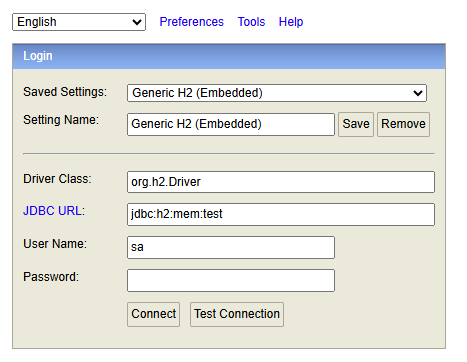

# 📝 소개

- - -
카카오테크 캠퍼스 백엔드 step2 과정으로 카카오톡의 선물하기 기능을 클론 코딩하는 것을 목적으로 한다.

# 📖 API 명세

- - -

## 상품 관리 API

| URL                       | 메서드    | 기능            | 설명           |
|---------------------------|--------|---------------|--------------|
| /api/products             | POST   | 상품 생성         | 새로운 상품 등록    |
| /api/products             | GET    | 상품 조회 (목록 조회) | 상품 목록 조회     |
| /api/products/{productId} | GET    | 상품 조회 (단건 조회) | 특정 상품의 정보 조회 |
| /api/products/{productId} | PUT    | 상품 수정         | 기존 상품 정보 수정  |
| /api/products/{productId} | DELETE | 상품 삭제         | 기존 상품 삭제     |

## 인증 API

| URL                  | 메서드  | 기능   | 설명                    |
|----------------------|------|------|-----------------------|
| `/api/auth/register` | POST | 회원가입 | 이메일과 비밀번호로 회원 가입 수행   |
| `/api/auth/login`    | POST | 로그인  | 이메일과 비밀번호로 로그인, 토큰 발급 |

## 위시리스트 API

| URL                       | 메서드    | 기능       | 설명                       |
|---------------------------|--------|----------|--------------------------|
| `/api/wishes`             | POST   | 위시 생성    | 상품을 위시리스트에 추가합니다.        |
| `/api/wishes`             | GET    | 위시 목록 조회 | 사용자의 모든 위시리스트 항목을 조회합니다. |
| `/api/wishes/{productId}` | DELETE | 위시 삭제    | 특정 상품을 위시리스트에서 제거합니다.    |

[자세한 API 문서 보러 가기](Api.md)

# 🛠️ 관리자 페이지

관리자는 웹 기반 UI를 통해 상품 정보를 관리하는 것이 가능하다.

- 접속 주소: http://localhost:8080/admin/products

---

## 주요 기능

- 상품 등록: 상품명, 가격, 이미지 URL 입력
- 상품 수정: 기존 상품 정보 수정
- 상품 삭제: 불필요한 상품 제거
- 상품 목록: 전체 상품 확인

---

# 🗄️️ 데이터베이스 연결

H2 In-Memory 데이터베이스를 사용하여 간단한 개발 및 테스트 환경을 구성한다.

## 접속 정보

- H2 콘솔 주소: http://localhost:8080/h2-console
- JDBC URL: jdbc:h2:mem:test
- Username: sa
- Password: (비워둠)

## 접속 방법

1. 서버를 실행한 후 브라우저에서 `http://localhost:8080/h2-console` 로 접속
2. JDBC URL 입력란에 `jdbc:h2:mem:test` 입력
3. 사용자명은 `sa`, 비밀번호는 공란으로 둔 채 Connect 클릭

## 콘솔 접속 화면 예시



---

# 유효성 검사 및 예외 처리

## 주요 검사

- 상품 이름은 공백을 포함하여 최대 15자까지 제한
- 특수 문자 제한    
  가능: ( ), [ ], +, -, &, /, _ <br>
  그 외 특수 문자 사용 불가
- "카카오"가 포함된 문구는 담당 MD와 협의한 경우에만 사용할 수 있도록 제한

# JDBC -> JPA 마이그레이션

## 주요 변경 사항

- Member, Product, Wish 엔티티 클래스를 `@Entity` 기반 JPA 엔티티로 변환
- 각 엔티티와 관련된 레포지토리(SQL 직접 작성에서 메소드 기반으로 변경), 서비스(변경된 레포지토리 메소드로 변경) 변경
- `@ManyToOne`으로 연관관계를 매핑하여 더 이상 단순히 Id 값으로 연결하는 것이 아니라 객체를 직접 참조하는 방식으로 변경
- `@DataJpaTest`를 통한 테스트 코드 작성

# 페이지네이션

## 주요 변경 사항

- 상품, 위시리스트에 페이지네이션 적용
- admin 화면 페이지네이션 적용

## API 변경점

| URL             | 메서드 | 기능       | 설명                                      |
|-----------------|-----|----------|-----------------------------------------|
| `/api/wishes`   | GET | 위시 목록 조회 | 사용자의 모든 위시리스트 항목을 **페이지네이션**과 함께 조회합니다. |
| `/api/products` | GET | 상품 목록 조회 | 전체 상품 목록을 **페이지네이션 및 정렬**과 함께 조회합니다.    |

-> 각각 page = 1, size = 10, sort = id;desc으로 기본값이 설정되어있습니다.

## 페이지네이션 요청 예시

### 주의 사항

`;`를 구분자로 하여 sort의 정렬할 대상과 방향(asc, desc)를 구분합니다.

- 상품 예시

```
GET /api/products?page=2&size=5&sort=price;desc
```

- 위시 리스트 예시

```
GET /api/wishes?page=1&size=10&sort=productName;asc
```

- 다중 정렬 예시

```
GET /api/wishes?page=1&size=10&sort=price;desc&sort=productName;asc
```

price 내림차순 우선 정렬 후 상품명으로 오름차순 정렬합니다.